---
---
---

# Capstone Project - Roberto Atallah

# Integrated analysis of lncRNA-miRNA-mRNA ceRNA network in human renal cell carcinoma

## Introduction

Renal cell carcinoma (RCC) is the most common type of kidney cancer, accounting for approximately 90% of all kidney cancer cases. Despite advances in diagnosis and treatment, RCC still poses a significant health threat, with a 5-year survival rate of less than 10% for advanced stage disease. In recent years, non-coding RNAs (ncRNAs) have emerged as important regulators of gene expression and have been implicated in the pathogenesis of various cancers, including RCC. Among ncRNAs, long non-coding RNAs (lncRNAs) have garnered particular interest due to their involvement in numerous biological processes, such as cell differentiation, proliferation, and apoptosis. Furthermore, lncRNAs have been shown to play a critical role in the development and progression of RCC.

Recently, competing endogenous RNA (ceRNA) networks have been proposed as a novel regulatory mechanism involving lncRNAs, microRNAs (miRNAs), and messenger RNAs (mRNAs). In ceRNA networks, lncRNAs can act as sponges for miRNAs, thereby regulating the expression of downstream target mRNAs. Dysregulation of ceRNA networks has been implicated in various diseases, including cancer.

In this study, I aimed to comprehensively analyze the lncRNA-miRNA-mRNA ceRNA network in human RCC. I integrated data from multiple sources to construct a ceRNA network and performed functional enrichment analysis to identify key biological pathways and processes involved in RCC. Our findings may provide insights into the molecular mechanisms underlying RCC and potential therapeutic targets for this deadly disease.

## Microarray Data

### Materials & Methods

One dataset was chosen by setting the screening criteria for the species type as "Homo sapiens", from GEO database of National Center for Biotechnology Information (NCBI) ([https://www.ncbi.nlm.nih.gov/geo/),](https://www.ncbi.nlm.nih.gov/geo/),) with such keywords being searched as "**Renal Cell Carcinoma**", "miRNA", "mRNA". Then study type "Expression Profiling by Array" was selected. As a result, I included the dataset **GSE16441**, which is divided into two platforms. Platform GPL6480 (Agilent-014850 Whole Human Genome Microarray 4x44K G4112F), Samples GSM413237-GSM413270, contains the total RNA expression data from 17 RCC tumor samples and 17 corresponding non-tumor samples and was used to find differentially expressed lncRNA and mRNA. Platform GPL8659 (Agilent Human miRNA Microarray Rel12.0) Samples GSM413271-GSM413304, contains the miRNA microarray expression data from 17 RCC tumors and 17 corresponding non-tumor samples and was used to find differentially expressed microRNAs.

## DEGs Analysis

### Materials & Methods

DEGs are analyzed by R package "Linear Models for Microarray Data (**limma**)" function for datasets and "**GEOquery**" R package was used to retrieve to GSE from GEO database. Let me note that the data was already LOISS normalized and log2 transformed as indicated in the matrix file. For the GPL6480 platform (the total RNA one), **log Foldchange\>2 and adjust. p\<0.05** Ire regarded as threshold values for selecting DEGs and DELs. For the GPL8659 platform samples (the micro-RNA one), l**og Foldchange\>1 and adjust. p\<0.05** Ire regarded as threshold values for selecting DEGs and DElncRNAs. Statistical significance for the selection of this threshold was found, and those genes that Ire up- and down- regulated can also be selected for performing the subsequent analysis. R software was also used to draw volcano map of DELs, DEmiRs and DEmRNAs. This data would be used in the following ceRNA network construction and protein interaction network construction.

### Code

DEG

``` r
#   Differential expression analysis with limma
setwd("~/Documents/capstone/rscripts/")
library(GEOquery)
library(limma)
library(dplyr)

# load series and platform data from GEO

gset <- getGEO("GSE16441", GSEMatrix =TRUE, AnnotGPL=TRUE)
if (length(gset) > 1) idx <- grep("GPL6480", attr(gset, "names")) else idx <- 1
gset <- gset[[idx]]
pData(gset)$data_processing[1] #Data has already been LOISS normalized and log2 transformed, it is indicated in file.
# make proper column names to match toptable

fvarLabels(gset) <- make.names(fvarLabels(gset))

# group membership for all samples
gsms <- "0000000000000000011111111111111111"
sml <- strsplit(gsms, split="")[[1]]
#Data has already been LOISS normalized and log2 transformed, it is indicated in file.
# assign samples to groups and set up design matrix
gs <- factor(sml)
groups <- make.names(c("RCC","Normal"))
levels(gs) <- groups
gset$group <- gs
design <- model.matrix(~group + 0, gset)
colnames(design) <- levels(gs)

fit <- lmFit(gset, design)  # fit linear model

# set up contrasts of interest and recalculate model coefficients
cts <- paste(groups[1], groups[2], sep="-")
cont.matrix <- makeContrasts(contrasts=cts, levels=design)
fit2 <- contrasts.fit(fit, cont.matrix)

# compute statistics and table of top significant genes
fit2 <- eBayes(fit2, 0.01) 

tT <- topTable(fit2, adjust="fdr", sort.by="B", number=Inf)

tT <- subset(tT, select=c("ID","adj.P.Val","P.Value","t","B","logFC","Gene.symbol","Gene.title", "Gene.ID"))

#Take table and mutate it based on condition to extract DEGs
deg <- tT %>%
  mutate(condition = abs(logFC) > 2 & adj.P.Val < 0.05 & Gene.symbol != "")
# summarize test results 
sum(deg$condition == TRUE)
sum(deg$condition== TRUE & deg$logFC > 0)
sum(deg$condition== TRUE & deg$logFC < 0)

deg <- subset(deg, deg$condition == TRUE)

write.csv(deg, file="../files/DEG_table.csv", row.names=FALSE)
write.table(deg$Gene.ID, file= "../files/DEG_IDs.txt", row.names = FALSE, col.names = FALSE)
write.table(deg$Gene.symbol, file= "../files/DEG_symbols.txt", row.names = FALSE, col.names = FALSE)
#REGEX to take long non coding RNA from the data
write.table(grep("LINC.*", deg$Gene.symbol, value = TRUE), "../files/LNC.txt", row.names = FALSE, col.names = FALSE)
#finding top 20 DEGs significant and top 6 LNC
head_deg <- subset(head(deg, n=20), select= c("Gene.symbol","adj.P.Val","P.Value","logFC"))

lnc <- deg[grep("LINC.*", deg$Gene.symbol), ]
lnc_head <- subset(head(lnc, n=6), select= c("Gene.symbol","adj.P.Val","P.Value","logFC"))
#writing to file
write.table(head_deg, file="../files/DEG_table_head.csv", row.names=FALSE)
write.table(lnc_head, file="../files/LNC_table_head.csv", row.names=FALSE)
# volcano plot (log P-value vs log fold change)
library(ggplot2)

tT %>% 
  mutate(Significant = adj.P.Val < 0.05 & abs(logFC) > 2) %>% 
  ggplot(aes(x = logFC, y = -log10(adj.P.Val), col=Significant)) + geom_point()

ex <- exprs(gset)

# box-and-whisker plot
ord <- order(gs)
palette(c("#1B9E77", "#7570B3", "#E7298A", "#E6AB02", "#D95F02","#66A61E", "#A6761D", "#B32424", "#B324B3", "#666666"))
par(mar=c(7,4,2,1))
title <- paste ("GSE16441", "/", annotation(gset), sep ="")
boxplot(ex[,ord], boxIx=0.6, notch=T, main=title, outline=FALSE, las=2, col=gs[ord])
legend("topleft", groups, fill=palette(), bty="n")
```

DEM

``` r
#   Differential expression analysis with limma
setwd("~/Documents/capstone/rscripts/")
library(GEOquery)
library(limma)
library(dplyr)

# load series and platform data from GEO

gset <- getGEO("GSE16441", GSEMatrix =TRUE, AnnotGPL=TRUE)
if (length(gset) > 1) idx <- grep("GPL8659", attr(gset, "names")) else idx <- 1
gset <- gset[[idx]]

# make proper column names to match toptable 
fvarLabels(gset) <- make.names(fvarLabels(gset))

# group membership for all samples
gsms <- "0000000000000000011111111111111111"
sml <- strsplit(gsms, split="")[[1]]
#Data has already been LOISS normalized and log2 transformed, it is indicated in file.
# assign samples to groups and set up design matrix
gs <- factor(sml)
groups <- make.names(c("RCC","Normal"))
levels(gs) <- groups
gset$group <- gs
design <- model.matrix(~group + 0, gset)
colnames(design) <- levels(gs)

fit <- lmFit(gset, design)  # fit linear model

# set up contrasts of interest and recalculate model coefficients
cts <- paste(groups[1], groups[2], sep="-")
cont.matrix <- makeContrasts(contrasts=cts, levels=design)
fit2 <- contrasts.fit(fit, cont.matrix)

# compute statistics and table of top significant genes
fit2 <- eBayes(fit2, 0.01) 
tT <- topTable(fit2, adjust="fdr", sort.by="B", number=Inf)

tT <- subset(tT, select=c("ID","adj.P.Val","P.Value","t","B","logFC","miRNA_ID","SPOT_ID"))

dem <- tT %>%
  mutate(condition = abs(logFC) > 1 & adj.P.Val < 0.05)
# summarize test results 
sum(dem$condition == TRUE)
sum(dem$condition== TRUE & dem$logFC > 0)
sum(dem$condition== TRUE & dem$logFC < 0)
dem <- subset(dem, dem$condition == TRUE)
write.csv(dem, file="../files/dem_table.csv", row.names=FALSE)
write.table(dem$miRNA_ID, file= "../files/dem_symbols.txt", row.names = FALSE, col.names = FALSE)
#finding top 20 DEMs significant
head_dem <- subset(head(dem, n=20), select= c("miRNA_ID","adj.P.Val","P.Value","logFC"))
write.table(head_dem, file="../files/dem_table_head.csv", row.names=FALSE)

# summarize test results 


# volcano plot (log P-value vs log fold change)
library(ggplot2)

tT %>% 
  mutate(Significant = adj.P.Val < 0.05 & abs(logFC) > 1) %>% 
  ggplot(aes(x = logFC, y = -log10(adj.P.Val), col=Significant)) + geom_point()

ex <- exprs(gset)

# box-and-whisker plot
ord <- order(gs)
palette(c("#1B9E77", "#7570B3", "#E7298A", "#E6AB02", "#D95F02","#66A61E", "#A6761D", "#B32424", "#B324B3", "#666666"))
par(mar=c(7,4,2,1))
title <- paste ("GSE16441", "/", annotation(gset), sep ="")
boxplot(ex[,ord], boxIx=0.6, notch=T, main=title, outline=FALSE, las=2, col=gs[ord])
legend("topleft", groups, fill=palette(), bty="n")
```

### Results

According to the cut-off criteria mentioned above, volcano plots Ire obtained. I finally found that in the samples of total RNA, 880 differentially expressed, having 213 upregulated and 667 downregulated. Among these total RNA, I have 6 DElncRNAs, 5 downregulated and 1 upregulated. Also, in the miRNA sample I found 87 differentially expressed miRNAs, 55 being upregulated and 32 downregulated.

### Figures

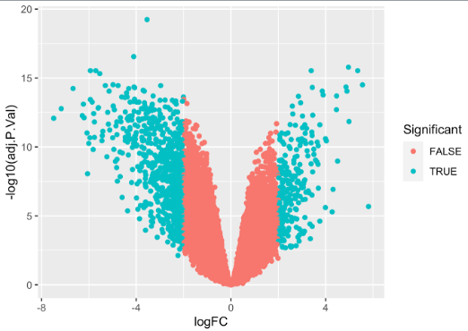{width="339"}

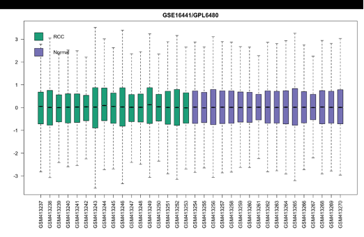{width="372"}

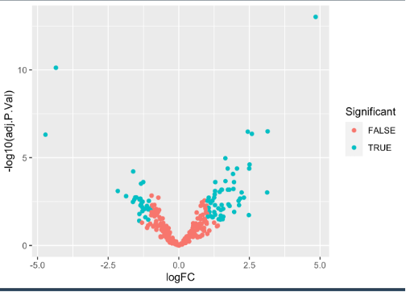{width="337"}

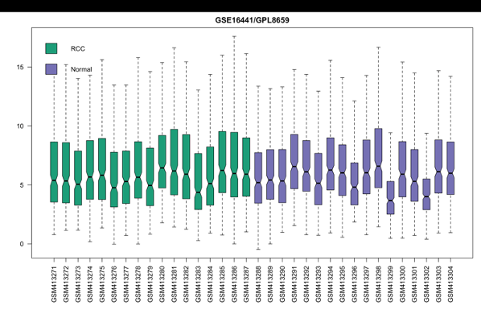{width="371"}

### Tables

{width="287"}

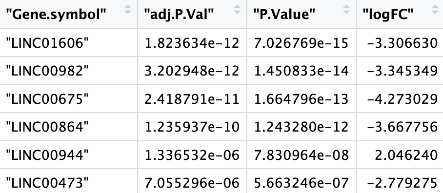{width="286"}

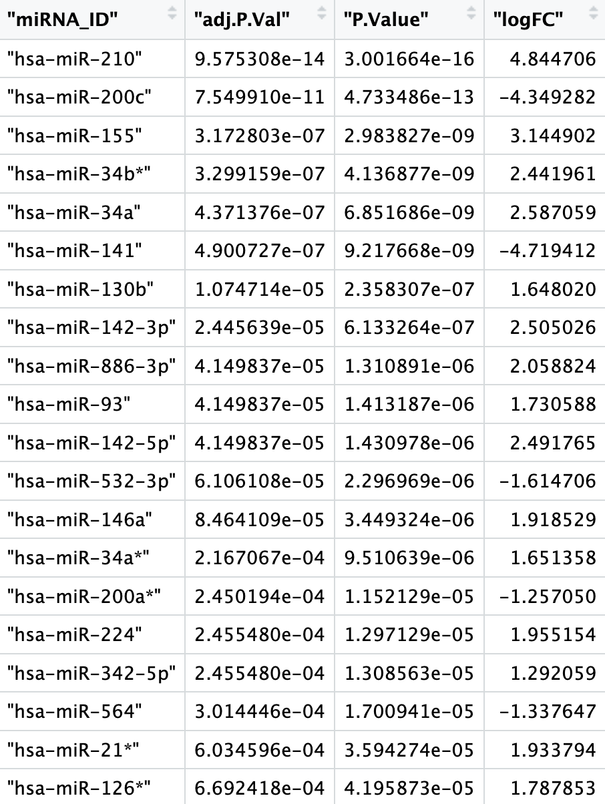{width="285"}

## Gene Ontology and Pathway Analysis

### Materials & Methods

The Database for Annotation, Visualization and Integrated Discovery (DAVID, [http://david.abcc.ncifcrf.gov/)](http://david.abcc.ncifcrf.gov/)) is a Ib resource that offers functional interpretation of plenty of genes derived from genomic researches. In present study, DAVID database was used to perform Gene Ontology (GO) and Kyoto Encyclopedia of Genes and Genomes (KEGG) pathway analysis. The ontology contains three hierarchies: biological process (BP), cellular component (CC) and molecular function (MF). Pathway analysis is a functional analysis that maps genes to KEGG pathways. Herein, I performed GO analysis and KEGG pathway analysis using only the differentially expressed genes that I obtained. The P value denoted the significance of the GO and pathway term enrichment in the DEGs. "P value \<0.05" was set as the cut-off criterion. All of that was performed with an R script.

### Results

I found significant results in GO terms and KEGG pathways which will be displayed below. Most of them are related to functions in the kidney that might be affected by Renal Cell Carcinoma, like excretion, membrane transports, mineral absorption, etc\... Also I see notice that 43 genes are related in pathways in cancer in the KEGG pathways, and others are related to other metabolic pathways in kidney.

### Table

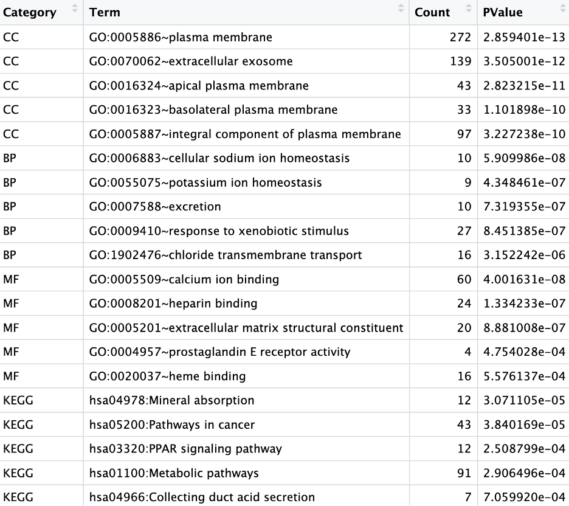{alt="Table 4: Top 5 significant GO Terms by Category and KEGG pathways" width="462"}

### Figure

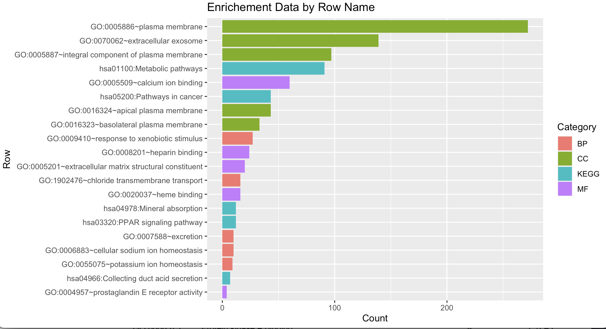

### Code

``` r
setwd("~/Documents/capstone/rscripts/")
load(dplyr)
#This table was downloaded from DAVID database, and taking top 5 of each category by P value
#PS the data of table is already ordered by P.value
chart<-read.table("../files/chart_4CBB66A493291681316993753.txt", sep="\t", header = TRUE)
cc <- chart[grep("^GOTERM_CC", chart$Category), ][1:5, ]
bp <- chart[grep("^GOTERM_BP", chart$Category), ][1:5, ]
mf <- chart[grep("^GOTERM_MF", chart$Category), ][1:5, ]
kegg <- chart[grep("^KEGG", chart$Category), ][1:5, ]

#Restructuring the tables
cc <- cc %>% 
  mutate(Category = "CC") %>%
  select(Category, everything())
  
cc<-cc[,c(1:3, 5)]


bp <- bp %>% 
  mutate(Category = "BP") %>%
  select(Category, everything())

bp<-bp[,c(1:3, 5)]


mf <- mf %>% 
  mutate(Category = "MF") %>%
  select(Category, everything())

mf<-mf[,c(1:3, 5)]


kegg <- kegg %>% 
  mutate(Category = "KEGG") %>%
  select(Category, everything())

kegg<-kegg[,c(1:3, 5)]
#Binding all rows together
enrichement<- rbind(cc, bp, mf, kegg)

temp <- enrichement
temp$Term <- substr(temp$Term, 1, 10)
library(ggplot2)
# create a bar plot of the enrichment data
ggplot(enrichement, aes(x = Count, y = reorder(Term, Count), fill = Category)) +
  geom_bar(stat = "identity") +
  xlab("Count") +
  ylab("Row") +
  ggtitle("Enrichement Data by Row Name")

write.csv(enrichement, "../files/enrichement.csv")
  
```

## Prediction of miRNA-mRNA and lncRNA-miRNA pairs & Establishment of the ceRNA network of lncRNA-miRNA-mRNA

### Materials & Methods

Interaction between lncRNAs and miRNAs were predicted with **DIANA-LncBase v3, miRNA-lncRNA targets** (<https://diana.e-ce.uth.gr/lncbasev3/interactions>).\
I then intersected the predicted miRNAs with the DEmiRs found previously and obtained miRNAs that I then used in the **mirWalk database**([http://mirwalk.umm.uniheidelberg.de/search_mirnas/](http://mirwalk.umm.uni-heidelberg.de/search_mirnas/)), which is a comprehensive database that provides predicted and validated miRNA binding sites of known genes of human, rat, cow, mouse, and dog. The predicted target genes found in this database search were intersected with my DEmRNAs to find final DEmRNAs. The final ceRNA network was visualized using cytoscape.

### Results

From the six DElncRNAs, only four were found to interact with miRNAs by using the DIANA-LncBase database. These interactions which are a total 64 can be visualized in the figure 6. However 56 unique miRNA were predicted (1 miRNA may interact with many lncRNA), and by taking the intersection of these 56 miRNA with the DEmiRNAs already found before, we will find only three miRNAs interacting with three LncRNAs: hsa-miR-28-5p that interacts with LINC00982; hsa-miR-532-5p that interacts with LINC00944 and hsa-miR-140-5p that interacts with LINC00473.\
Then using mirWalk database, these three miRNAs have been found to interact with 12,248 target mRNAs. By doing the intersection of these predicted mRNAs (which are gene targets) with the 880 differentially expressed mRNAs already found before, and I found 208 genes common between the two, these were the final DEmRNAs. 267 miRNA-mRNA interactions were selected (because 1 mRNA can be targeted by many miRNA), and combined with the lncRNA-miRNA interaction, I obtained the ceRNA network in figure 7.

### Code

### Figures

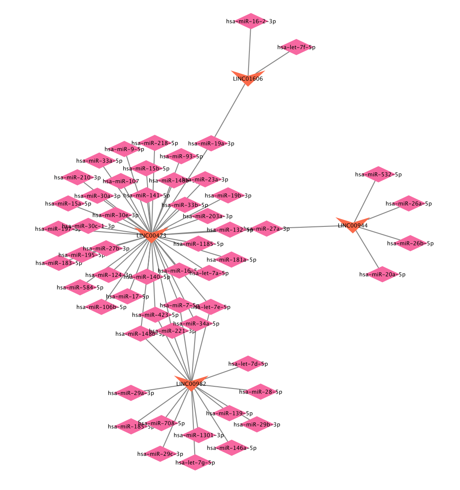{width="453"}

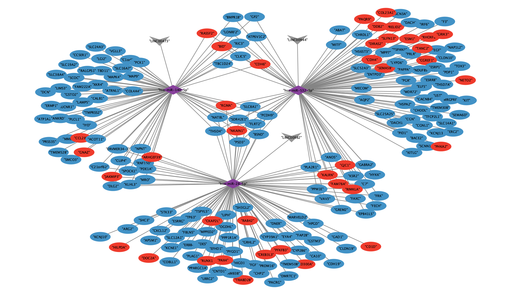{width="703"}

## PPI network analysis and key gene indentification

### Materials & Methods

The plug-in CytoHubba in Cytoscape software is a visualization software that obtains the dense relationship through the degree of connectivity. Those hub genes in ceRNA network were identified by CytoHubba. The present study adopted the Search Tool for the Retrieval of interacting Genes/Proteins (STRING; version 11.5) for retrieving protein interactions between the 208 DEGs found earlier. The PPI network was visualized using cytoscape then CytoHubba was used to identify the hub genes of PPI network. The key genes were determined by taking the intersection of hub genes in the ceRNA network and PPI network. They were used for follow-up analysis.

### Results

The top 30 DEGs of ceRNA network acquired based on degree of connectivity using cytohubba were visualized in figure 8. When uploading these DEGs identified in ceRNA network to STRING website, 188 edges were found and 208 nodes in constructing the PPI network (figure 9). The top 30 DEGs of PPI network obtained by cytoHubba were visualized in figure 10. There were three key genes (BSND, RGMA, THSD4) which were determined by Venn Diagram of ceRNA network and PPI network (figure 11). They key genes were then visualized with cytoscape (figure 12)

### Figures

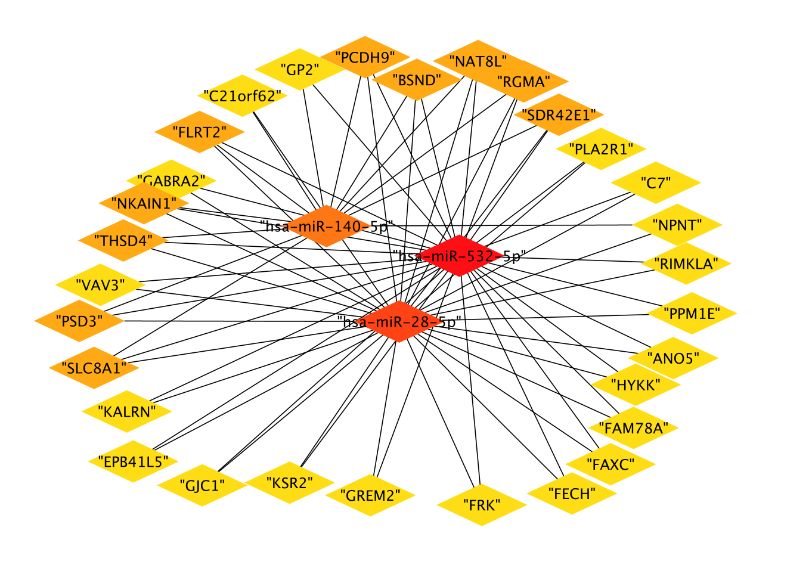{width="446"}

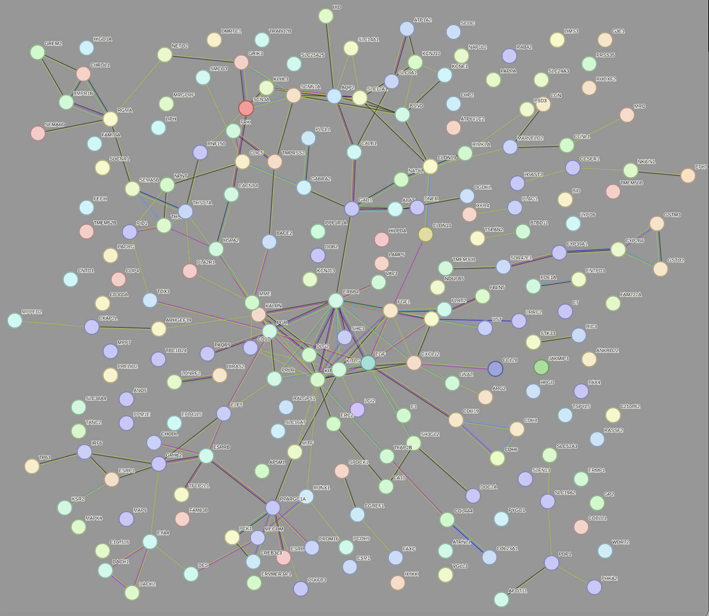{width="702"}

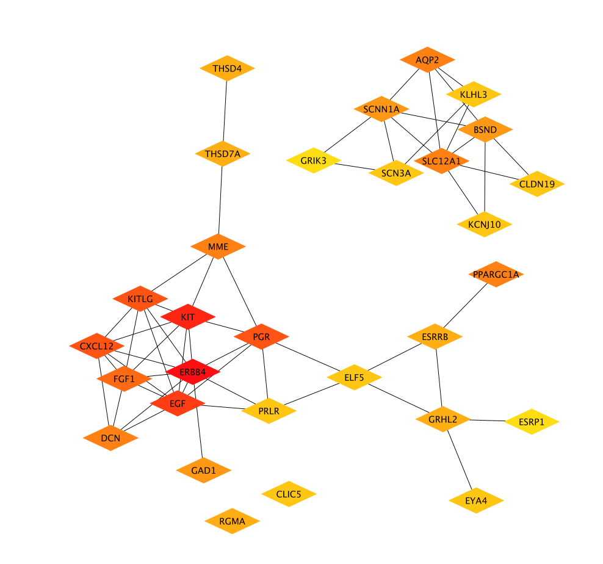{width="444"}

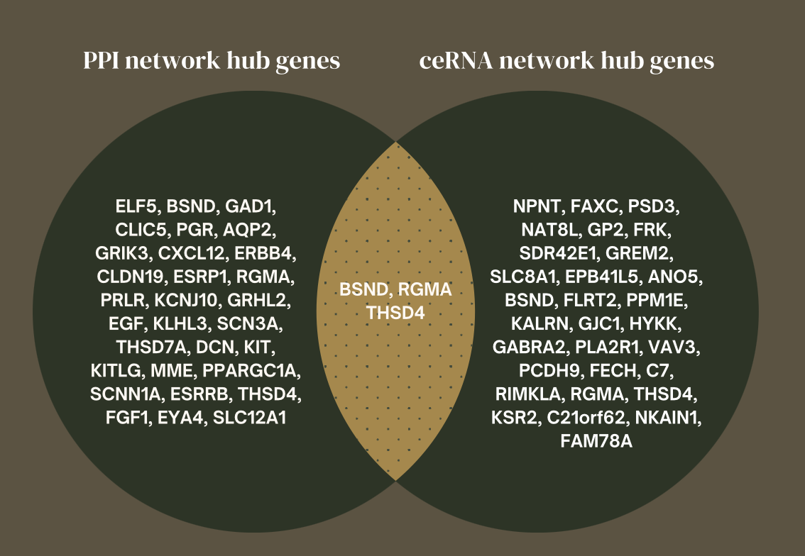{width="424"}

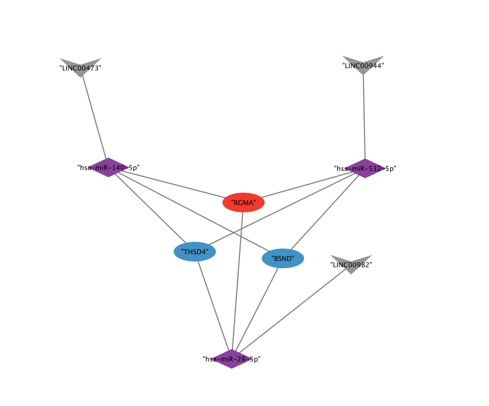{width="421"}

### Code

``` r
setwd("~/Documents/capstone/rscripts/")
deg <- read.csv("../files/DEG_table.csv")
dem <- read.csv("../files/dem_table.csv")
#Reading file of lncRNA miRNA interactions then taking predicted miRNA ids without duplicates
lncmiR <- read.csv("../files/lncRNA_miRNA.csv")

write.table(unique(lncmiR$miRNA), "../files/miRNA_predicted.txt", row.names = FALSE, col.names = FALSE)
miRNA_predicted <- read.table("../files/miRNA_predicted.txt")
#Finding intersections of miRNA in DEM file and predicted ones
miRNA_intersection <- intersect(dem$miRNA_ID, miRNA_predicted$V1)
write.table(miRNA_intersection, "../files/miRNA_intersection.txt", row.names = FALSE, col.names=FALSE)
#We got 3 miRNAs found in both DEM and predicted."hsa-miR-532-5p" "hsa-miR-140-5p"and "hsa-miR-28-5p"
#Now we want to find the genes that are targets to these three using 3 DB

#MIRWalk Target of miRNA prediction
mirwalk_pred <- read.csv(file = "../files/miRWalk_miRNA_Targets-3.csv")
mirwalk_pred <- mirwalk_pred[, c(1,3)]
intersection_table <- subset(mirwalk_pred, mirwalk_pred[,2] %in% deg$Gene.symbol)
#removing duplicate rows because some miRNA mRNA interactions are written multiple times (multiple binding sequences)
intersection_table <- distinct(intersection_table)

write.csv(intersection_table, "../files/intersection_table_miRNA_mRNA.csv", row.names = FALSE)

length(unique(intersection_table$target)) 
# Print 

miRNA_values <- c("hsa-miR-140-5p", "hsa-miR-532-5p", "hsa-miR-28-5p")
lncRNA_miRNA_filtered <- subset(lncmiR, miRNA %in% miRNA_values)
write.table(lncRNA_miRNA_filtered, "../files/lncRNA_miRNA_filtered.csv", row.names = FALSE)
colnames(lncRNA_miRNA_filtered)[1:2] <- c("source", "target")
colnames(intersection_table)[1:2] <- c("source", "target")
#adding column to see if up or down regulated for further visualization in cytoscape
deg_updated <- deg
deg_updated$regulation <- ifelse(deg_updated$logFC > 0, "up", "down")
dem_updated <- dem
dem_updated$regulation <- ifelse(dem_updated$logFC > 0, "up", "down")
#for loop to see if gene up or down regulated
for (i in 1:nrow(intersection_table)) {
  gene <- intersection_table[i, 2]
  match_row <- which(deg_updated$Gene.symbol == gene)
  if (length(match_row) > 0) {
    regulation <- deg_updated[match_row[1], "regulation"]
  } else {
    regulation <- "NA"
  }
  intersection_table[i, "regulation"] <- regulation
}
for (i in 1:nrow(lncRNA_miRNA_filtered)) {
  mirna <- lncRNA_miRNA_filtered[i, 2]
  match_row <- which(dem_updated$miRNA_ID == mirna)
  if (length(match_row) > 0) {
    regulation <- dem_updated[match_row[1], "regulation"]
  } else {
    regulation <- "NA"
  }
  lncRNA_miRNA_filtered[i, "regulation"] <- regulation
}
cytoscape <- rbind(intersection_table, lncRNA_miRNA_filtered)
write.table(cytoscape, "../files/cytoscape_to_import.csv", row.names = FALSE)


write.table(unique(intersection_table$target), "../files/deg_intersection.txt", row.names = FALSE, col.names = FALSE)

#getting hub genes from both PPI and ceRNA network, 
ppi_hub <- read.csv("../files/PPI_hub.csv", header = TRUE)#exported from cytoscape
cerna_hub <- read.csv("../files/ceRNA_hub.csv", header = TRUE)#exported from cytoscape
cerna_hub$name <- gsub('"', '', cerna_hub$name)
result <- merge(ppi_hub, cerna_hub, by.x = "display.name", by.y = "name")
result$display.name
#to use in venn diagram
write.csv(ppi_hub$display.name, "../files/ppi_hub_genes.txt", row.names = FALSE, col.names = FALSE)
write.csv(cerna_hub$name, "../files/cerna_hub_genes.txt", row.names = FALSE, col.names = FALSE)
```

## Discussion

Renal cell carcinoma (RCC) is a type of kidney cancer that is responsible for a significant number of cancer-related deaths worldwide. The dysregulation of various genes, including those involved in the regulation of metabolic pathways, membrane transport, and apoptosis, is known to contribute to the development and progression of RCC. In recent years, long non-coding RNAs (lncRNAs) have emerged as important regulators of gene expression and have been implicated in the pathogenesis of various cancers, including RCC.

In a recent study, I investigated the ceRNA (competing endogenous RNA) network in RCC using bioinformatic analysis. Specifically, I focused on the interactions between lncRNAs, miRNAs, and mRNAs and how they contribute to the regulation of gene expression in RCC.

The study identified several lncRNAs that interacted with miRNAs and mRNAs in the RCC ceRNA network, including LINC00473 (down regulated), LINC00944 (up regulated), and LINC00982 (down regulated), as well as miRNAs hsa-miR-140-5p (up regulated), hsa-miR-28-5p (up regulated), and hsa-miR-532-5p (down regulated), which were found to interact with the genes RGMA (up regulated), BSND (down regulated), and THSD4 (down regulated).

These results provide insights into the regulatory mechanisms underlying RCC development and progression. The ceRNA network provides a novel perspective on the regulation of gene expression, particularly with the identification of lncRNAs as important players in the process. Additionally, the study highlights the potential for targeting these lncRNAs, miRNAs, and mRNAs as a therapeutic strategy for RCC treatment.

However, it is important to note that these findings are based on bioinformatic analysis, and further experimental validation is required to confirm the interactions between these RNAs and genes in RCC. Nonetheless, the results provide a valuable starting point for further investigation into the mechanisms underlying RCC pathogenesis and the development of new therapeutic strategies for this disease.
